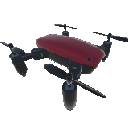
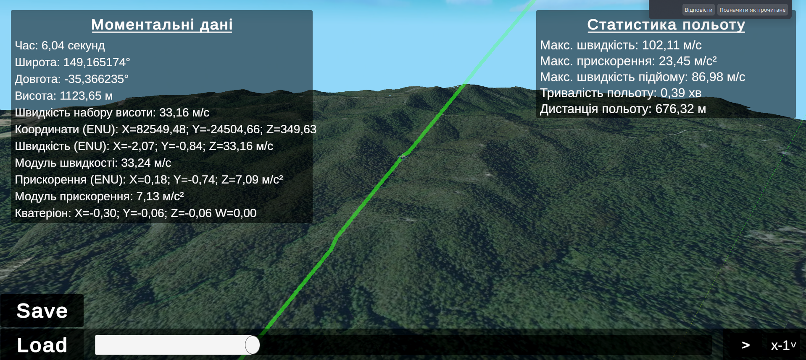
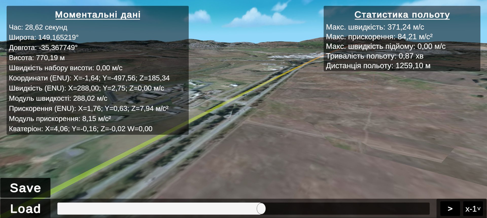

# Larp-Team-BEST-HACKath0n

## Тестове завдання: “Система аналізу телеметрії та3D-візуалізації польотів БПЛА”

Розробіть програмне рішення для автоматизованого розбору лог-файлів польотних контролерів (FC на базі Ardupilot), візуалізації маршруту та обчислення підсумкових метрик польоту. Інструмент має конвертувати абстрактні "сирі" дані з датчиків (GPS, IMU) у зручний для аналізу формат,
коректно працювати з просторовими системами координат та побудувати точну 3D-модель переміщення апарату.

### Вимоги

#### Основні функціональні вимоги

1. **Обробка телеметрії (Data Parsing)**: Система має приймати на вхід бінарні лог-файли, які будуть надіслані учасникам, із записом польоту (згенерований FC на базі Ardupilot). Алгоритм має розпарсити їх, витягнути повідомлення від датчиків GPS та IMU, визначити їхні частоти семплювання та одиниці вимірювань, і автоматично сформувати структурований масив даних (наприклад, pandas DataFrame), готовий до аналізу.

2. **Ядро аналітики (Обчислення метрик)**: Автоматичне обчислення з лог-файлу підсумкових показників місії:

    - максимальна горизонтальна та вертикальна швидкість,
    - максимальне прискорення,
    - максимальний набір висоти,
    - загальна тривалість польоту.

Обов'язкова алгоритмічна реалізація: загальна пройдена дистанція має вираховуватись через функцію **haversine**, а отримання швидкостей з масиву прискорень має відбуватися через реалізацію методу **трапецієвидного інтегрування**.

3. **Панель 3D-візуалізації**: Побудова інтерактивного інструменту для перегляду просторової траєкторії. Панель 3D-візуалізації:

    - Система має виконувати математичну конвертацію глобальних координат **WGS-84** у локальну **декартову систему ENU** (метри від точки старту). 
    - Графік має бути тривимірним (з висотою як третьою віссю) та підтримувати **динамічне колорування траєкторії** залежно від швидкості руху або плину часу.

#### Додаткові вимоги

- **Інтерактивний дашборд**: Оформлення рішення не просто як набору скриптів, а як веб-застосунку (наприклад, за допомогою Streamlit, Dash або аналогів), куди користувач може завантажити файл через інтерфейс і одразу побачити результати.

- AI-асистент: Інтеграція LLM для автоматичного формування текстового висновку про політ (наприклад,
виявлення різких втрат висоти, перевищення швидкості тощо). Рекомендується використовувати безкоштовні API.

- Теоретичне обґрунтування в коді: Наявність у коментарях або документації математичного пояснення
перетворень (наприклад, чому для орієнтації вигідніше використовувати кватерніони замість кутів Ейлера для уникнення gimbal lock, або пояснення природи похибок при подвійному інтегруванні IMU).

### Демонстрація

Для початку роботи вам потрібно обрати файл. Щоб завантажити .BIN файл, натисніть на кнопку **Load** та виберіть відповідний файл з вашого комп'ютера.

Після цього, система автоматично розпарсить дані, обчислить метрики та відобразить їх у відповідних секціях інтерфейсу. Ви зможете побачити:

- **Загальну інформацію про політ**: тривалість, максимальна швидкість, максимальне прискорення, максимальну швидкість підйому та пройдений шлях.
- **3D-візуалізацію траєкторії**: інтерактивний графік, де ви можете обертати камеру навколо дрона та масштабувати зображення, а також бачити колірну індикацію швидкості. 
- **Дані реального часу**: поточні координати, швидкість, висота та інші параметри, які оновлюються в режимі реального часу під час перегляду траєкторії.

#### Функціональні можливості

- **Статистика польоту**, про неї вже було сказано;
- **3D-візуалізація траєкторії** з колірною індикацією швидкості. Чорний колір відповідає стану спокою, зелений - низькій швидкості, а червоний - високій;
- Програма реалізована як **переглядач 3Д-відео польоту**, де можна зупинити відтворення, перемотати його вперед або назад, а також змінити швидкість відтворення.
- **Дані реального часу**: поточні координати (WSG-89), висота, швидкість підйому, координати ENU, швидкість в ENU, прискорення в ENU, кватерніон повороту. Всі ці дані відповідають тому.
- **Реальна місцевіть польоту**: програма автоматично завантажує 3D-модель місцевості з сервісу Mapbox. Користувач може побачити, як дрон рухався над реальною місцевістю, а не над абстрактною плоскою поверхнею.
- **Збереження текстового файлу про кінематичні точки польоту**, які можна використовувати для подальшого аналізу або в інших програмах, наприклад LLM.

#### Як запустити

**Найлегший варіант**: запустити вже скомпільовану програму для [Linux](./Release/Linux.zip) або [Windows](./Release/Windows.zip). Білди знаходяться у папці Release.

Або можна завантажити код, та Unity, скомпілювати проєкт.
